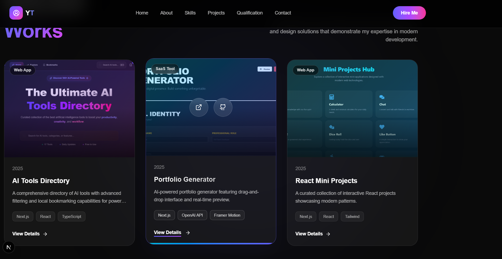
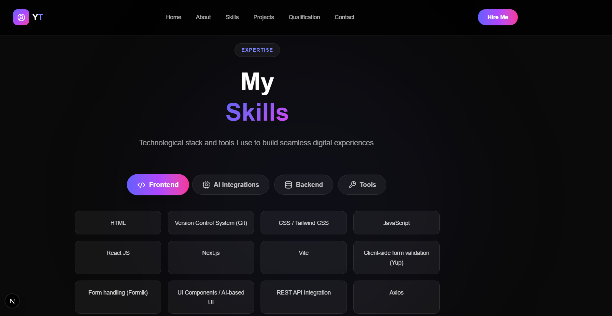
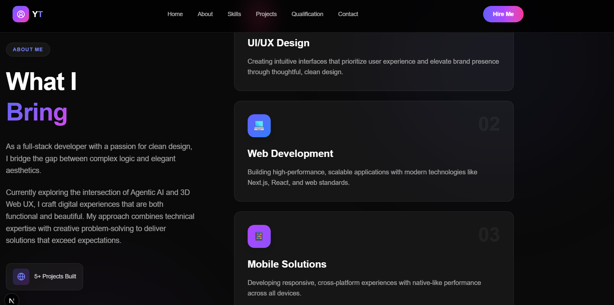
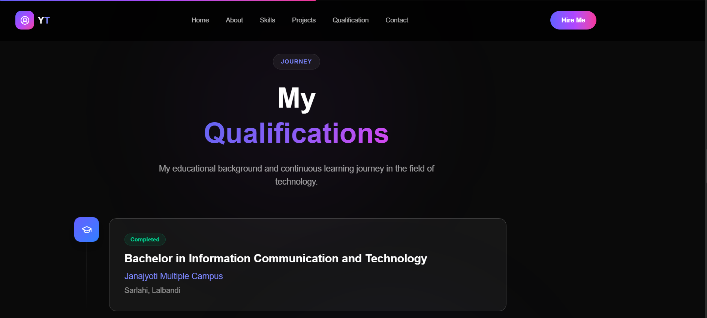
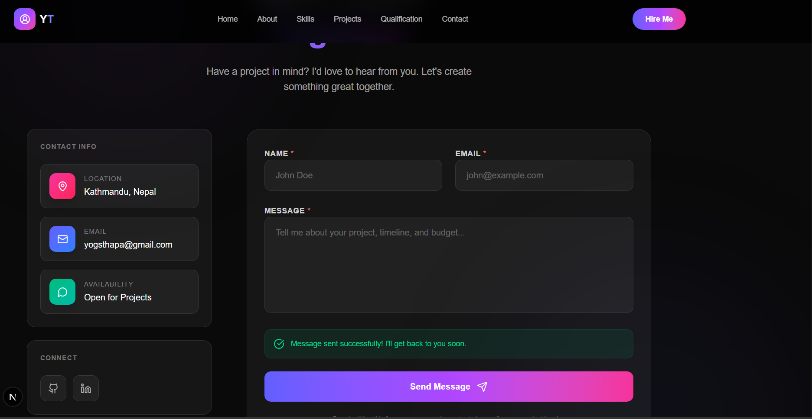
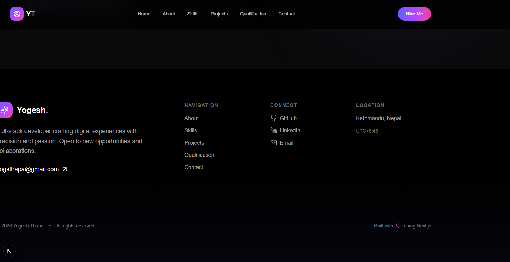

<!DOCTYPE html>
<html lang="en">
<head>
    <meta charset="UTF-8">
    <meta name="viewport" content="width=device-width, initial-scale=1.0">
    <title>Creative Developer Portfolio</title>
    
</head>
<body>
    

        <header>
            <h1>Creative Developer Portfolio</h1>
            
A high-performance, aesthetically pleasing portfolio website built with modern web technologies

        </header>

        

            <h2>Tech Stack</h2>
            

                Next.js 15
                TypeScript
                Tailwind CSS
                React 19
                Framer Motion
            

            

                Built on Next.js 15 with App Router, featuring full TypeScript support for reliability and maintainability. Styled with Tailwind CSS for responsive, utility-first design.
            

        

        

            <h2>Features</h2>
            

                

                    <h3>Modern Tech Stack</h3>
                    
Built on Next.js 15 (App Router) and React 19 with full TypeScript support.

                

                

                    <h3>Responsive Design</h3>
                    
Mobile-first approach ensuring a great experience on all devices.

                

                

                    <h3>Performance Optimized</h3>
                    
Uses next/font, next/image, and efficient code splitting for optimal loading.

                

                

                    <h3>Premium UI Effects</h3>
                    
Glassmorphism cards, magnetic gradients, smooth scroll animations.

                

            

        

        

            <h2>Project Screenshots</h2>
            

                

                    
                    
Featured Projects

                

                

                    
                    
Skills & Expertise

                

                

                    
                    
About Me

                

                

                    
                    
Experience & Education

                

                

                    
                    
Get In Touch

                

                

                    
                    
Footer Section

                

            

        

        

            <h2>Getting Started</h2>
            

                

                    

                        <h4>Clone the repository</h4>
                        
Copy the repository to your local machine using Git.

                    

                

                <pre><code>git clone https://github.com/yogeshthapa-7/portfolio.git
cd portfolio</code></pre>

                

                    

                        <h4>Install dependencies</h4>
                        
Install all required npm packages.

                    

                

                <pre><code>npm install</code></pre>

                

                    

                        <h4>Run the development server</h4>
                        
Start the local development server.

                    

                

                <pre><code>npm run dev</code></pre>

                

                    

                        <h4>Open in browser</h4>
                        
View your portfolio at the local URL.

                    

                

                <pre><code>http://localhost:3000</code></pre>
            

        

        

            <h2>Project Structure</h2>
            <pre class="tree">portfolio/
├── app/
│   ├── components/   # Reusable UI components
│   ├── api/         # API routes
│   ├── layout.tsx    # Root layout with fonts
│   ├── page.tsx      # Main landing page
│   └── globals.css   # Global styles
├── public/         # Static assets
└── package.json</pre>
        

        

            <h2>Customization</h2>
            <ul>
                <li><strong>Colors & Styling:</strong> Modify in <code>app/globals.css</code> and Tailwind classes.</li>
                <li><strong>Fonts:</strong> Uses Geist font family via next/font.</li>
                <li><strong>Projects:</strong> Update the <code>projects</code> array in <code>app/components/projects.tsx</code>.</li>
                <li><strong>Contact Form:</strong> Integrate with EmailJS or Formspree for real functionality.</li>
            </ul>
        

        

            
<strong>Note:</strong> The projects section uses mock data for demonstration. Update with your actual work details and screenshots.

        

        

            <a href="https://github.com/yogeshthapa-7/portfolio" class="cta-button">View on GitHub</a>
        

    

</body>
</html>